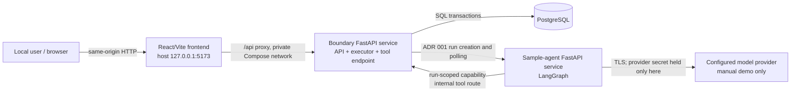

# Boundary Phase 1 Architecture

## 1. Context and constraints

This document translates `docs/product-spec.md`, `docs/phase-1-plan.md`, and accepted ADRs 001–003 into the smallest implementable Phase 1 system. The required successful path is:

```text
normal control run
→ vulnerable injected run
→ finalized evidence
→ deterministic FAIL and localization
→ immutable regression-case materialization
→ fixed-version rerun from the regression case
→ deterministic PASS
→ inspectable UI
```

The fixed-version rerun is one user operation containing a fresh fixed-version control run followed by the fixed-version injected run. This is the smallest interpretation that preserves ADR 003's requirement that each evaluated injected run have a finalized, identity-compatible successful control. If ADR 003 intended a vulnerable-version control to qualify a fixed-version injected run, that ADR must be clarified; this architecture does not silently weaken the identity rule.

The architecture has these invariants:

- PostgreSQL is authoritative for execution state, accepted evidence and order, finalized evidence sets, analyses, policy results, regression cases, and comparisons.
- Boundary owns run identities, receipt order, fault configuration and application proof, evaluability, assertions, localization, policy results, and regression integrity.
- The tested agent and all of its events, status, output, and model-provider content are untrusted.
- The tested agent is a separate FastAPI/LangGraph HTTP service and implements ADR 001. Boundary does not redefine that contract.
- The Boundary control plane is deterministic Python service code. LangGraph exists only in the bundled sample agent.
- A run is analyzed only after its evidence is finalized once. Analysis never mutates evidence.
- `PASS` and `FAIL` require evaluable evidence. `INVALID`, `EXECUTION_ERROR`, and `INCOMPLETE` retain ADR 003's precedence.
- Completed runs, evidence sets, analyses, regression cases, and completed comparisons are append-only.
- Phase 1 runs one campaign at a time in one Boundary process. It makes no durable-execution, high-availability, enterprise-authentication, or multi-tenant claim.
- No Redis, distributed worker, queue service, OpenTelemetry collector, Kubernetes resource, or production cloud component is present.

The reduced physical schema in Section 8 changes only how immutable audit facts are grouped. It does not remove any product-specification acceptance criterion, ADR-required fact, evidence reference, invariant, digest, UI field, or verification path.

Every Phase 1 requirement has one primary owner:

| Requirement | Primary owner |
| --- | --- |
| Campaign sequencing, deadlines, cancellation, and restart reconciliation | Boundary execution module |
| Tested-agent invocation, status polling, and event polling | Boundary system-under-test client, implementing ADR 001 |
| Vulnerable and fixed agent behavior and target event retention | Sample-agent service |
| Tool stub, capability validation, retry ordinals, and timeout realization | Boundary injection module, implementing ADR 002 |
| Receipt order, evidence validation, cutoff, manifest, and digest | Boundary evidence module plus PostgreSQL |
| Evaluability, assertions, localization, and five-state aggregation | Boundary evaluation module, implementing ADR 003 |
| Regression materialization, invariance, and comparison | Boundary regression module plus PostgreSQL |
| User-facing resources and safe serialization | Boundary API |
| Campaign, run, evidence, provenance, and comparison inspection | React frontend |
| Durable relational constraints and atomicity | PostgreSQL persistence module |
| Local service lifecycle and provider configuration | Docker Compose |
| Deterministic fake-model behavior and configured real-model selection | Sample-agent model port |
| Requirement verification | Backend, frontend, contract, integration, workflow, and Compose test suites |

## 2. System topology

Phase 1 uses four long-running containers and one one-shot migration container:



Only the frontend port is published to the host. Boundary, PostgreSQL, the sample agent, and the tool route are reachable only on Compose networks. The frontend proxy forwards only the public `/api` prefix; it does not proxy the internal tool route.

The Boundary container is one process with internal modules, not a set of deployable microservices. Its public API, PostgreSQL-backed executor loop, system-under-test client, tool endpoint, evidence finalizer, evaluator, policy, and regression materializer share the same deployment and explicit persistence layer.

The sample agent is separate because ADR 001 requires an external process and network trust boundary. It contains both inspectable agent versions behind distinct immutable version identities. Its in-memory target status and append-only target-event buffer are contract-serving state, not Boundary authority. A sample-agent restart may lose that state and cause `EXECUTION_ERROR`; Phase 1 does not add another database to make the sample target durable.

## 3. Component responsibilities

### Boundary FastAPI service

The Boundary service owns:

- the user-facing API and safe response serialization;
- the single PostgreSQL-backed campaign executor loop;
- campaign and run lifecycle transitions;
- ADR 001 request construction, idempotent target creation, status polling, event polling, cancellation, and deadlines;
- the internal-only run-scoped tool endpoint;
- capability generation, hash storage, validation, expiry, and retirement;
- tool-call registration, retry-ordinal allocation, fault matching, activation accounting, durable `HOLD` decisions and activation records, process-local live response guards and monotonic waiters, and realized-effect proof;
- target-event validation, deduplication, receipt sequencing, rejected-event audit metadata, and durable cursor advancement;
- evidence cutoff, manifest construction, RFC 8785 canonicalization, SHA-256 digests, and finalization;
- the six evaluability checks, exact three-assertion vector, localization algorithm, and policy aggregation from ADR 003;
- regression eligibility, atomic materialization, rerun expansion, field-by-field invariance, and comparison;
- startup reconciliation, bounded shutdown, and cancellation.

It does not contain LangGraph, model calls, a generic workflow engine, a queue abstraction, or generic telemetry ingestion.

### Separate FastAPI/LangGraph sample-agent service

The sample service owns:

- the target side of ADR 001's run, status, event, and cancellation resources;
- one minimal LangGraph workflow for initial model-driven tool-and-argument selection;
- the deterministic post-selection vulnerable controller (`0`, `1`, then `2`);
- the deterministic post-selection fixed controller (`0`, `1`, then exact degraded result);
- the 500 ms tool-client timeout and use of Boundary's supplied tool URL and capability;
- contiguous producer sequencing, target status, final watermark, bounded terminal output, and target cancellation;
- a deterministic fake model for automated tests;
- one configured real-model adapter for the manual demonstration;
- immutable, inspectable version metadata for the vulnerable and fixed implementations.

The sample agent does not decide retry limits from model output, prove fault application, assign Boundary identities, evaluate policy, or report authoritative verdicts.

### PostgreSQL

PostgreSQL owns durable truth and concurrency control. It stores normalized definitions, operational transitions, evidence and ordering, tool calls and activations, finalization manifests, deterministic analyses, regression artifacts, invariance reports, and comparisons. Some immutable logical records are versioned canonical JSON documents inside their authoritative parent row rather than separate tables. Unique constraints, foreign keys, checks, document digests, and explicit row-locking protocols enforce ADR 003's transaction invariants.

PostgreSQL is not used as a generic message broker. The executor performs a bounded query for accepted work and waits on a short local interval when idle. Phase 1 has one executor and one campaign at a time.

### React/Vite/TypeScript frontend

The frontend owns only user interaction and presentation. It starts the bundled campaign or a rerun, polls Boundary resource state, retrieves ordered evidence, and renders authoritative and untrusted facts distinctly. It computes no verdict, localization, digest, or invariance result.

### Docker Compose

Compose owns the supported clean-start topology, private service discovery, health ordering, database initialization, one-shot migrations, fake-versus-real model configuration, and local secret injection. It is the Phase 1 deployment target, not a model of production infrastructure.

### Model-provider connection

The sample agent owns one provider adapter for the configured manual demonstration. The provider may choose only the initial tool and arguments. Provider latency, refusal, invalid selection, or outage becomes bounded execution/evidence state; it cannot change timeout recovery, injection evidence, assertions, or verdicts. Automated tests never require a provider or provider secret.

## 4. End-to-end control and data flows

The API accepts work synchronously into PostgreSQL and the in-process executor performs live execution asynchronously. “Retryable” below means safe only under the stated identity and deadline; it does not authorize creating a replacement run.

| Step | Complete flow | Execution properties |
| --- | --- | --- |
| 1. Control campaign execution | `POST` creates a bundled campaign and its vulnerable-version control run. The executor claims the campaign, creates a fresh capability with an explicit no-fault binding, and invokes the sample agent under ADR 001. The agent selects the initial tool, calls the normal Boundary stub once, receives the fixed success result, and completes without retry. | API acceptance is **synchronous**, **transactional**, and idempotent by request key. Live work is **asynchronous** and serial. Target creation is retryable only with the same `run_id` and normalized request. A failed or non-successful control stops the successful-path campaign; no misleading injected comparison is claimed. |
| 2. Vulnerable injected execution | After the control finalizes as valid success, the executor creates the injected sibling run with the same scenario and vulnerable agent version, immutable `fault_spec_id`, and a fresh `fault_id` and capability. The sample's deterministic controller issues tool calls with distinct IDs. Boundary observes ordinals `0`, `1`, and `2`; only `0` and `1` match the fault. | Run creation and transition are **transactional**. Execution is **asynchronous**. Fresh execution identities are mandatory. The accepted ordinal `2` is terminal localization evidence even if later execution fails or times out. |
| 3. Target status and event polling | Boundary polls ADR 001 status and contiguous target event pages every 100 ms with bounded backoff. It validates contract, run, trace, target, version, producer sequence, final watermark, and payload limits. A page and its durable producer cursor advance atomically; a gap never advances the cursor. | Poll `GET`s are **idempotent** and transient failures are **retryable** within the run/evidence budget. Accepted events are **transactional**. Conflicts, lower sequences after advancement, changed watermarks, or false authority are terminally `INVALID`. |
| 4. Boundary tool calls and timeout realization | Each tool request synchronously validates the capability and identities. One registration transaction reserves the unique `tool_call_id`, assigns the ordinal, and appends receipt-ordered arrival evidence. For matching ordinals `0`/`1`, before that transaction commits, the handler disables its normal success path in a process-local response guard and the transaction also commits the durable `HOLD` decision and receipt-ordered `fault_activation_started` record. After commit, that same live guard and monotonic waiter actually withhold the response. At the 500 ms client boundary, a second transaction records realized effect only when the live guard proves no response was sent. The hold ends by 1,000 ms. Ordinal `2` is registered and receipt-ordered but receives `attempt_not_selected`. | Each request is **synchronous** from the target's perspective but contains an asynchronous bounded wait. Registration/activation and effect proof are separate required **transactions**. PostgreSQL preserves the decision and evidence, not the live HTTP guard or waiter. A failed registration/activation transaction creates no activation claim and the handler aborts without pretending the fault occurred. Reuse of a `tool_call_id` is a deterministic conflict. Process loss during activation is ambiguous and becomes `EXECUTION_ERROR`. |
| 5. Evidence finalization | Once the target seals its stream and Boundary reaches the final watermark, or the evidence deadline expires, the finalizer waits until all Boundary-owned in-flight records have settled. It closes acceptance, records gaps/failures, constructs the canonical manifest and digest, and creates one evidence set. Later events become rejected late-arrival audit metadata. | **Asynchronous** and **idempotent**. A transaction plus unique `evidence_sets.run_id` constraint permits only one finalized record to commit, and that record is immutable. Multiple finalization attempts may execute; a retry returns or verifies the same committed record. This is single-finalization state, not exactly-once execution. |
| 6. Evaluability and assertion processing | The executor evaluates the six ADR 003 checks over the finalized manifest. Only `EVALUABLE` evidence produces exactly the three assertion results. The evaluator is a pure versioned transformation. | Computation is **synchronous** inside the executor after finalization. Persistence of the full result is **transactional** and idempotent by evidence digest plus analyzer/assertion/policy versions. `INVALID` precedes `EXECUTION_ERROR`, which precedes `INCOMPLETE`. |
| 7. Localization and policy aggregation | In the same analysis, Boundary records `tool_execution` and the two timeout chains as the injection boundary, selects authoritative ordinal `2` as `P1.RETRY_LIMIT`'s first unsafe divergence at `retry_control`, records later symptoms, and aggregates the assertion vector. The vulnerable run becomes `FAIL`. | Pure, deterministic, and committed with the assertion vector in one **transaction**. `PASS`/`FAIL` are terminal for that immutable analysis, not for all future reevaluations. |
| 8. Regression-case materialization | A qualifying original injected `FAIL` is automatically submitted to the materializer. It locks the source analysis, revalidates eligibility, creates the immutable artifact and integrity digest, and links all provenance and evidence. The explicit materialization API is an idempotent “ensure/get” operation over the same transaction. | **Synchronous** database materialization after analysis, **transactional**, **idempotent**, and terminally immutable. Nonqualifying results are rejected. |
| 9. Fixed-version rerun | A rerun request names the case, `version_comparison`, and the distinct fixed version. Boundary expands immutable values, creates a pre-invocation invariance report, rejects any drift, and schedules a fresh fixed-version control followed by the fixed injected run. Both execute real agent logic. The injected run has fresh run, trace, fault, event, tool-call, capability, and evidence identities. | API acceptance is **synchronous** and **transactional**; execution is **asynchronous**. Same normalized request/key is idempotent. Target creation and polling have ADR 001 retry semantics. Invariant mismatches are terminal pre-invocation conflicts. |
| 10. Version comparison | After fixed evidence finalization and analysis, the fixed run passes all checks and assertions. Boundary completes runtime identity rows in the invariance report and creates a comparison only when source is `FAIL`, candidate is `PASS`, versions differ, and every invariant matches. | Deterministic and **transactional**. A completed report/comparison is immutable and **terminal**. A same-version reproduction can complete but is never labeled a version comparison. |
| 11. UI retrieval and evidence inspection | The browser polls campaign state, follows run/case/comparison links, pages evidence by authoritative `receipt_seq`, and displays evaluability, assertions, injection proof, localization, symptoms, provenance, invariance, and scoped results. | Read operations are **synchronous**, **idempotent**, and retryable. UI polling stops on terminal resource state. It does not recompute or cache authoritative conclusions. |

The materialized case freezes or content-addresses the source campaign/run/trace and evidence-set provenance, original tested-agent identity/version, contract and scenario versions, tested input and digest, normalized fault definition and digest, source `fault_id` as provenance, analyzer/assertion-set/policy versions, source analysis and failed assertion, ordinal `2` localization, supporting evidence references, and artifact integrity digest.

Every rerun report compares `regression_case_id`, contract version, scenario identity/version, tested-agent logical identity, tested input/digest, `fault_spec_id` and normalized definition/digest, analyzer version, assertion-set version, and policy version. Fresh run/trace/fault/event/tool-call/capability/evidence identities, current campaign identity, timestamps, receipt sequences, tested-agent version when allowed by the mode, and resulting evidence/analysis are explicit permitted differences rather than hidden drift.

Operational status and policy result remain separate. A run may end `timed_out` with conclusive `FAIL`, or with `INCOMPLETE`; a Boundary/process failure normally yields operational `failed` and policy `EXECUTION_ERROR`; contradictory authority evidence yields operational `invalid` and policy `INVALID`.

## 5. Process, restart, and cancellation model

### Options

| Model | Benefit | Failure behavior and cost | Phase 1 decision |
| --- | --- | --- | --- |
| Run the campaign in the API request | Fewest moving pieces | Couples browser/proxy deadlines to execution, loses clean cancellation, and makes partial-evidence/restart behavior poor; conflicts with ADR 001's asynchronous target lifecycle | Reject |
| In-process asynchronous task with memory as the work list | Quick `202` response | Accepted work can disappear on restart and orphan detection has no authoritative source | Reject |
| PostgreSQL-backed executor loop inside Boundary | Durable acceptance and state, one deployment, explicit reconciliation, no queue service | Live Python stack, HTTP response guard, and monotonic waiter are still not durable; requires honest startup rules | **Select** |
| Separate worker | Isolates execution from API lifecycle | Adds another service, claiming/lease behavior, deployment lifecycle, and failure surface without Phase 1 load or isolation need | Reject |

### Selected behavior

One FastAPI process runs one executor loop from its application lifespan. Compose runs exactly one Boundary replica and one ASGI worker. The executor queries PostgreSQL for the oldest accepted campaign and processes only one campaign at a time. Every accepted operation exists in PostgreSQL before the API returns `202`.

This is durable acceptance, not durable execution. For an activated call, PostgreSQL preserves the committed `HOLD` decision, activation identity, correlations, and receipt-ordered `fault_activation_started` evidence. The active HTTP response guard and monotonic waiter are process-local runtime objects. PostgreSQL cannot prove that either remained live after process loss, recreate them, or retroactively establish `fault_effect_realized`.

Startup reconciliation runs before readiness:

1. Committed `accepted` campaigns/runs with no target acknowledgement or unsettled Boundary tool work are safe to resume. The executor reuses the same `run_id`; ADR 001 makes equivalent target creation idempotent.
2. A `running` run may resume polling only when PostgreSQL proves the interruption occurred between polling operations and there is no unsettled tool request, committed `HOLD` awaiting effect disposition, live-response-guard dependency, finalization, or analysis transaction.
3. Any run with a committed activation whose process-local guard/waiter disposition is unknown, an ambiguous target interaction, or missing proof of a safe polling-only point is not resumed. Boundary records a reconciliation failure, best-effort cancels the target, settles/finalizes partial evidence, transitions the run to operational `failed`, and produces `EXECUTION_ERROR` unless `INVALID` precedence applies.
4. A transaction interrupted before commit leaves no claimed durable decision or evidence. A committed `HOLD` and activation record survive, but after loss of their live guard/waiter they cannot be upgraded to `fault_effect_realized`; the run follows the preceding `EXECUTION_ERROR` rule.
5. Already finalized evidence and analyses are verified by their unique keys and digests and are never recomputed in place. Eligible downstream materialization or comparison work can resume idempotently.

This limited safe-resume rule must be tested; implementation may conservatively terminate more running work as `EXECUTION_ERROR`, but may not resume an ambiguous activation.

Cancellation is a durable, idempotent campaign command:

- the API records `cancel_requested` and a Boundary cancellation identity;
- immediately before target creation, the executor locks the authoritative campaign and atomically either observes `cancel_requested` or advances the run from `not_started` to the durable `target_interaction` checkpoint. This transaction is the cancellation/invocation linearization point. If cancellation wins, Boundary settles the prepared run without any target I/O. If execution wins, the transaction commits before the later network write and active-run cancellation semantics apply; no PostgreSQL transaction spans that write;
- the executor prevents unstarted sibling runs from starting;
- for an active target run it records Boundary cancellation evidence, invokes ADR 001 cancellation, retires the tool capability, and collects through the 2,000 ms grace period;
- a sealed target cancellation becomes operational `cancelled`; no seal in time becomes `timed_out`;
- collected evidence is finalized and normally evaluates `INCOMPLETE` unless stronger evidence or precedence applies;
- cancelling an already terminal campaign returns its existing terminal representation and changes nothing.

On graceful shutdown, Boundary becomes unready, stops claiming new campaigns, requests cancellation of active work, and uses the same bounded grace/finalization path. If the container is forcibly stopped, startup reconciliation applies. Shutdown does not promise to finish the campaign.

Redis or a worker queue is unnecessary because there is one bounded serial executor, PostgreSQL already owns accepted work and transitions, target creation is idempotent by `run_id`, and no throughput, fan-out, delivery, or cross-host coordination requirement exists. Adding a queue would create a second authority and new acknowledgement semantics without making live timeout realization durable.

## 6. Repository structure

The proposed structure is intentionally concrete. Every directory below owns a current requirement.

```text
/
├── README.md
├── pyproject.toml                    # shared Python tool/test configuration only
├── compose.yaml                      # supported clean-start topology
├── .env.example                      # non-secret configuration contract
├── backend/
│   ├── pyproject.toml                # Boundary runtime and test dependencies
│   ├── Dockerfile
│   ├── src/boundary/
│   │   ├── main.py                   # FastAPI assembly and lifespan
│   │   ├── config.py                 # validated environment configuration
│   │   ├── api/
│   │   │   ├── errors.py             # safe public problem responses
│   │   │   └── routes/
│   │   │       ├── health.py
│   │   │       ├── campaigns.py
│   │   │       ├── runs.py
│   │   │       ├── regression_cases.py
│   │   │       ├── comparisons.py
│   │   │       └── internal_tools.py
│   │   ├── domain/
│   │   │   ├── identities.py
│   │   │   ├── lifecycle.py
│   │   │   ├── definitions.py       # validated canonical scenario/fault documents
│   │   │   ├── evidence.py
│   │   │   ├── evaluation.py        # one canonical analysis document type
│   │   │   └── regression.py        # case/rerun/comparison document types
│   │   ├── execution/
│   │   │   ├── executor.py
│   │   │   ├── campaign.py
│   │   │   ├── reconciliation.py
│   │   │   └── clock.py
│   │   ├── sut/
│   │   │   ├── contract_v1.py
│   │   │   ├── client.py
│   │   │   └── polling.py
│   │   ├── injection/
│   │   │   ├── capability.py
│   │   │   ├── fault_spec.py
│   │   │   ├── tool_stub.py
│   │   │   └── timeout.py
│   │   ├── evidence/
│   │   │   ├── collector.py
│   │   │   ├── ordering.py
│   │   │   ├── canonical.py
│   │   │   └── finalizer.py
│   │   ├── evaluation/
│   │   │   ├── evaluability_v1.py
│   │   │   ├── assertions_v1.py
│   │   │   ├── localization_v1.py
│   │   │   └── policy_v1.py
│   │   ├── regression/
│   │   │   ├── materializer.py
│   │   │   └── rerun.py             # invariance and comparison behavior
│   │   └── persistence/
│   │       ├── database.py
│   │       ├── tables.py             # the 12 physical Phase 1 tables
│   │       ├── store.py              # explicit queries; no per-record repository layer
│   │       └── transactions.py
│   └── tests/
│       ├── unit/
│       ├── contract/
│       ├── integration/
│       ├── workflow/
│       └── api/
├── sample-agent/
│   ├── pyproject.toml
│   ├── Dockerfile
│   ├── src/sample_agent/
│   │   ├── main.py                   # target FastAPI assembly
│   │   ├── contract_v1.py            # independent target implementation
│   │   ├── run_store.py              # bounded target status/event retention
│   │   ├── graph.py                  # LangGraph initial selection
│   │   ├── model.py                  # fake and configured real provider port
│   │   ├── tool_client.py
│   │   └── versions/
│   │       ├── vulnerable.py
│   │       └── fixed.py
│   └── tests/
│       ├── contract/
│       └── workflow/
├── frontend/
│   ├── package.json
│   ├── vite.config.ts
│   ├── tsconfig.json
│   ├── Dockerfile
│   ├── src/
│   │   ├── api/
│   │   ├── routes/
│   │   ├── pages/
│   │   └── components/
│   └── tests/
├── migrations/
│   ├── alembic.ini
│   ├── env.py
│   └── versions/
├── tests/
│   └── e2e/                          # Compose and browser vertical-slice tests
├── docker/
│   ├── frontend-proxy.conf           # only /api is proxied to Boundary
│   └── compose.real-model.yaml       # explicit manual-demo override
└── docs/
    ├── architecture.md
    ├── product-spec.md
    ├── phase-1-plan.md
    ├── decisions/
    └── verification/                 # recorded clean-run and manual-demo evidence
```

There is no generic `common`, `platform`, `plugins`, `workers`, `telemetry`, or `infrastructure` directory. Contract implementations remain separate and are kept aligned by contract tests so shared code cannot erase the tested-agent trust boundary.

## 7. API surface

These are conceptual resources and behaviors, not application schemas. The separate tested-agent HTTP contract remains exactly ADR 001 and is not repeated here.

| Boundary resource | Behavior |
| --- | --- |
| `POST /api/v1/campaigns/bundled-tool-timeout` | Start the one bundled vulnerable campaign. Creates a campaign with a vulnerable control followed by a vulnerable injected run; returns `202` with campaign and known run links. It is not a general campaign builder. |
| `GET /api/v1/campaigns/{campaign_id}` | Return campaign status, current step, run links, cancellation state, regression-case link when available, and safe failure reason. |
| `GET /api/v1/runs/{run_id}` | Return operational status, policy result, tested-agent identities, finalization and analysis versions/digests, evaluability, assertion vector, localization, symptoms, provenance, and related resources. |
| `GET /api/v1/runs/{run_id}/evidence?after_receipt_seq={n}&limit={n}` | Return canonical accepted evidence in immutable receipt order plus authority labels and pagination. Rejected/late audit metadata is a separately labeled optional page, never mixed into evaluated evidence. |
| `POST /api/v1/runs/{run_id}/regression-case` | Idempotently ensure or retrieve materialization for an eligible original `FAIL`. The campaign normally invokes the same operation automatically. Noneligible source states return a conflict with a stable reason. |
| `GET /api/v1/regression-cases/{regression_case_id}` | Return immutable artifact identity, integrity digest, source provenance, bound definitions/versions, failed assertion/localization links, and existing rerun links. |
| `POST /api/v1/regression-cases/{regression_case_id}/reruns` | Start `reproduction` or `version_comparison` for a proposed tested-agent version. Expands the case, rejects invariant overrides, and schedules a fresh compatible control plus injected run. Returns the rerun campaign and, for comparison mode, comparison link. |
| `GET /api/v1/comparisons/{comparison_id}` | Return pending or terminal comparison state, source/candidate runs and analyses, completed field-by-field invariance report, permitted differences, and valid `FAIL`→`PASS` result or stable reason it is not a valid version comparison. |
| `POST /api/v1/campaigns/{campaign_id}/cancel` | Durably request cancellation of the current run and prevent later sibling runs. Repeated cancellation is idempotent. |

All mutating requests require an `Idempotency-Key`. Boundary stores the key, operation kind, normalized request digest, and created resource in PostgreSQL. Repeating the same key and digest returns the original resource; reuse with different normalized content returns `409 Conflict`. Domain identities such as `run_id` remain independently unique.

Validation failures return bounded problem details with stable machine codes and no raw rejected body. Conceptual HTTP behavior is:

- `202` for durably accepted asynchronous work;
- `200` for reads and repeated identical mutations;
- `404` for unknown Boundary-owned identities;
- `409` for state, idempotency, materialization, version-mode, or invariant conflicts;
- `422` for structurally invalid public input;
- `503` while database/migrations/startup reconciliation make Boundary unready.

Target/provider failures after accepted work do not become an unrelated API `500`; they are persisted as operational and policy state. An unexpected API or persistence failure returns a safe `500` and no success claim.

## 8. PostgreSQL model and transaction boundaries

### Comprehensive logical audit model

The ADR logical model remains comprehensive even when several records share a physical row:

| Logical record family | Required authoritative facts | Phase 1 physical home |
| --- | --- | --- |
| Campaigns, runs, and operational transitions | Current state, legal transition history, cancellation/reconciliation reason, run role and control linkage | Current projections in `campaigns`/`runs`; every transition is also append-only Boundary evidence in `evidence_records` |
| Tested-agent, contract, scenario, input, fault, assertion, analyzer, and policy definitions | Expected and reported identities, immutable versions, canonical definition bytes and digests | Stable columns and a versioned run-definition document in `runs`; frozen again in the regression artifact |
| Run-scoped fault and authorization | Fresh `fault_id`, exact fault/no-fault binding, capability hash/expiry/retirement | Fault fields/document in `runs`; secret-free binding in `run_capabilities` |
| Accepted and rejected evidence plus collection state | Source authority, event identities, producer and receipt order, cursors, watermark, gaps, size/digest metadata | Append-only `evidence_records`; collection cursor, watermark, counters, and acceptance flag in `runs` |
| Tool calls, retry ordinals, activations, and effects | Unique call arrival, Boundary ordinal, match/decision, activation, live-proof outcome, response disposition | `tool_calls`, `fault_activations`, and linked Boundary evidence |
| Finalized evidence set | Cutoff, ordered references, explicit gaps/failures, manifest and digest | One immutable `evidence_sets` row per run |
| Evaluability, assertions, localization, and policy | All six checks, zero or exactly three assertions, injection boundary, divergence, symptoms, precedence, result | One versioned canonical analysis document in `analyses`, with queryable aggregate columns |
| Regression artifact | Eligibility, full source provenance, immutable definitions/references, integrity digest | One immutable canonical artifact in `regression_cases` |
| Rerun invariance and comparison | Mode, pre-invocation field comparisons, runtime identity completion, permitted differences, source/candidate outcomes | Canonical invariance documents in `reruns`; identity/status/result in `comparisons` |

This logical model is the audit contract. Canonical-document consolidation does not make any listed fact optional or unqueryable through the Boundary API.

### Minimum Phase 1 physical schema

The minimum schema has **12 tables**:

| Physical table | Authority, stable identity, and contents | Concrete constraint requiring a table | Immutability and retention |
| --- | --- | --- | --- |
| `campaigns` | Boundary-owned `campaign_id`; campaign kind, current status/step, cancellation request, source case when applicable | Executor must claim and sequence accepted work independently of an API request | Current projection changes only through legal service transitions; retain as audit root |
| `runs` | Boundary-owned `run_id`, unique `trace_id`, campaign/role/control link, expected and reported target identities, current operational state, run-definition document/digest, optional fresh `fault_id`, producer cursor/watermark, next receipt/tool ordinal, evidence-open flag, in-flight disposition | Central row lock serializes receipt/ordinal allocation and excludes finalization; unique execution identities and legal terminal state need constraints | Definition/identity fields freeze before invocation; terminal state and sealed collection fields never reopen; retain partial and completed runs |
| `idempotency_records` | `(operation_kind, idempotency_key)`, normalized request digest, response/resource identity or stable rejected outcome | Concurrent duplicate public mutations must converge or conflict before creating resources | Immutable mapping retained as long as the referenced resource |
| `run_capabilities` | Secret-free capability record ID, token hash, run/trace/tool/fault-or-no-fault binding, expiry and retirement | Authentication lookup and one authoritative active binding per run need uniqueness and atomic retirement | Binding immutable; expiry/retirement move one way; raw token never stored |
| `evidence_records` | Boundary evidence ID, run/source/type/boundary, source event ID, producer sequence, accepted `receipt_seq`, causal IDs, canonical payload/digest, disposition and safe rejection or post-finalization audit metadata | Append-only evidence, source identity deduplication, producer order, and unique receipt order require row-level uniqueness | Accepted content immutable; rejected, late, and post-finalization operational audit records cannot enter the finalized accepted sequence; retain all partial evidence and transition audit |
| `tool_calls` | `(run_id, tool_call_id)`, authoritative retry ordinal, arrival evidence ID, request digest, match/no-match and response disposition | Unique call identity and serialized ordinal allocation are concurrent correctness requirements | Arrival/ordinal immutable; disposition moves only to a terminal value; retain as localization authority |
| `fault_activations` | Activation ID, run/fault/tool call, committed `HOLD` decision, activation evidence ID, monotonic relationships, effect status/proof document and effect evidence ID | At-most-once activation per call, maximum two per fault, and effect-to-activation foreign key require constraints and locking | `HOLD` decision immutable; effect may seal once as realized or unproven. It records durable facts, never a live guard |
| `evidence_sets` | Evidence-set ID, unique run, cutoff reason, canonical manifest/bytes/digest, finalization metadata | Unique `run_id` is the database enforcement point for one committed finalization record | Insert-only and immutable; permanent while any analysis/case references it |
| `analyses` | Analysis record ID, record kind (`authoritative` or `integrity_failure`), evidence set, analyzer/assertion-set/policy versions, evaluability aggregate, policy result, canonical analysis or bounded failure document/bytes/digest, optional prior-analysis link | A partial unique analysis key for authoritative rows prevents conflicting conclusions; an integrity-failure attempt must be appendable without replacing that row | Insert-only immutable records; retain every version and failed deterministic attempt |
| `regression_cases` | Stable `regression_case_id`, unique materialization identity/source analysis, canonical artifact/bytes/integrity digest | Eligibility and concurrent materialization must produce one identical artifact or a conflict | Insert-only immutable artifact; permanent Phase 1 provenance |
| `reruns` | Stable `rerun_id`, case, mode, requested target version, optional campaign/candidate run, status, pre-invocation invariance document/digest, write-once completed invariance document/digest | Rerun is a user-visible idempotent resource whose pre-invocation decision and later runtime identity completion have independent lifecycle | Pre-invocation document immutable at insert; completed document written once; terminal status immutable |
| `comparisons` | Stable `comparison_id`, rerun/case/source/candidate analysis links, current status, terminal result/reason and canonical summary/digest | Comparison status is independently polled and must enforce one source/candidate claim per comparison-mode rerun | Pending projection may seal once; terminal comparison immutable and retained |

Twelve tables are justified by concrete concurrency, identity, lifecycle, or public-resource constraints. No additional Phase 1 table is justified. In particular:

- scenario definitions, tested input, expected behavior, fault specifications, and their stable identities/digests are one strict run-definition document rather than `scenario_definitions`, `fault_specs`, `run_faults`, or `tested_agent_versions` tables;
- target collection state and receipt/ordinal counters are locked fields on `runs`, not a separate cursor table;
- legal operational transitions are append-only Boundary event records plus the current projection on `runs`, not a transition table;
- evaluability checks, assertion results, localization, symptoms, evidence references, fixed explanatory text, and policy output are one analysis document, not six check/result tables;
- regression artifact fields are one canonical document, not separate provenance/reference tables; and
- invariance entries are ordered arrays inside the pre-invocation and completed rerun documents, not report/row tables.

Every immutable document is validated against an exact versioned Pydantic model with unknown fields rejected. Its parent row stores the parsed JSON document for retrieval, the RFC 8785 canonical UTF-8 bytes needed for reproducibility, the lowercase SHA-256 digest, and the document schema version. PostgreSQL JSONB normalization is never treated as RFC 8785 canonicalization. Top-level identities, aggregate states, and foreign keys used for concurrency or common lookups remain ordinary relational columns.

Phase 1 has no definition-creation API and exactly one reviewed code-defined scenario, fault specification, assertion set, analyzer, and policy. Their stable IDs, exact canonical bytes, and expected digests are fixed implementation constants with digest fixtures; run acceptance verifies its document against those constants and against any prior stored run/case carrying the same identity. If Phase 1 ever permits a second independently created definition, a dedicated immutable definition registry table becomes justified and requires an architecture review rather than weakening ID-to-content uniqueness.

Foreign keys use restrictive deletion for immutable provenance. Phase 1 provides no API deletion. A local operator may reset the entire development database volume as an explicit clean-start action; partial deletion of referenced audit records is unsupported.

Indexes are limited to current paths: campaign status/creation order; runs by campaign/status; accepted evidence by `(run_id, receipt_seq)` and target producer sequence; tool calls by run/ordinal; analyses by unique analysis key; cases by source analysis; reruns/comparisons by case and status. No speculative JSONB, text-search, analytics, or time-series indexes are added.

### Transaction boundaries

All evidence writers first lock the owning `runs` row. This makes finalization mutually exclusive with new accepted evidence. The normal isolation level is `READ COMMITTED` with explicit row locks, check/unique constraints, and deterministic lock order (`run` → tool call/activation → evidence). Stronger isolation is used only if concurrency tests demonstrate an unclosed race.

1. **Run/campaign acceptance:** insert the idempotency record, campaign, runs, frozen run-definition documents, fresh fault identities where applicable, and initial Boundary transition evidence in one transaction before returning `202`.
2. **Receipt ordering and collection cursor:** lock the run, verify `evidence_open`, allocate the next `receipt_seq`, validate evidence uniqueness, and insert accepted canonical evidence atomically. A contiguous target page and the run's producer cursor advance in the same transaction; no gap advances it.
3. **Tool registration and activation decision:** lock the run, reject reused call identity, allocate the next retry ordinal, insert `tool_calls`, and append receipt-ordered arrival/ordinal evidence. For a matching call, before commit the request handler disables its normal success path in a process-local guard; the same transaction verifies the activation ceiling and inserts the immutable `HOLD` decision, activation row, and receipt-ordered `fault_activation_started` evidence. Unique call/ordinal constraints prevent concurrent duplicates. The commit preserves the decision and fact observed by the live handler; it does not persist that guard or its monotonic waiter.
4. **Realized effect:** only the same live process-local guard/waiter may supply the monotonic no-response observation at or after the client boundary. Lock the activation and atomically seal its proof fields plus linked `fault_effect_realized` evidence. `HOLD` alone can never satisfy this transaction. A crash, lost guard, clock failure, or failed commit creates no realized-effect claim and follows the restart `EXECUTION_ERROR` rule.
5. **Operational transition/cancellation:** lock the run, validate the legal state change, update its current projection, and append the corresponding Boundary record atomically. While evidence is open it receives normal accepted receipt order; a necessary evaluator/reconciliation transition after finalization is explicitly post-finalization audit metadata and cannot enter or change the closed manifest. Cancellation identity/state and capability retirement commit in the same transaction where applicable.
6. **Finalization:** a finalization attempt locks the run, verifies all relevant in-flight dispositions are settled, sets `evidence_open = false`, selects the immutable accepted sequence, adds cutoff/gap/failure markers, and inserts the manifest/digest in `evidence_sets` in one transaction. Unique `evidence_sets.run_id` permits one committed finalized record. Concurrent or retried attempts may run, but they return or verify the same immutable row; this is idempotent single-finalization, not exactly-once execution.
7. **Analysis:** compute from the finalized immutable snapshot, then insert one authoritative `analyses` row containing the complete canonical check collection, zero or exact three-result assertion vector, localization/symptoms, policy output, and digest. The partial unique analysis key must map to identical content. A different normalized result for an existing key appends an `integrity_failure` record with `EXECUTION_ERROR` and the attempted digest; it never overwrites or becomes a second authoritative conclusion.
8. **Regression materialization:** lock the source analysis/evidence set, recheck eligible original `FAIL`, and insert the complete regression artifact/digest. The unique materialization identity makes concurrent identical requests converge and conflicting content fail.
9. **Rerun acceptance/invariance:** lock the case, compare every invariant, and insert the `reruns` row with its canonical pre-invocation invariance document. A mismatch creates only a rejected rerun resource and no execution campaign. A match atomically creates the rerun campaign/runs, fresh fault identity, and idempotency mapping. After execution, runtime identity results write the completed invariance document once.
10. **Comparison:** lock the completed rerun, candidate analysis, and source analysis; verify all ADR 003 predicates; then seal the one `comparisons` row with its canonical summary/result. It never updates either analysis or regression artifact.

No domain behavior relies on ORM event hooks, implicit cascades, JSON mutation in place, or process-local locks as durable authority.

## 9. Package decisions

Versions will be pinned during implementation and updated only with the relevant tests. Every direct dependency must own a row below; transitive packages are not used as application APIs.

| Proposed dependency | Requirement owned | Closest alternative | Why Phase 1 needs it | Primary failure/debugging cost |
| --- | --- | --- | --- | --- |
| FastAPI | Boundary and sample HTTP resources, validation integration, lifespan | Starlette directly | Smallest reviewed Python API layer for two explicit HTTP contracts | Dependency-injection/lifespan errors can obscure transaction ownership |
| Pydantic v2 | Exact versioned wire/config validation and unknown-field rejection | Dataclasses plus manual validators | ADR 001/002 require strict bounded schemas and distinct trusted/untrusted fields | Coercion or serialization defaults can change canonical bytes; strict mode and explicit serializers are required |
| Uvicorn | ASGI runtime for both FastAPI services | Hypercorn | Minimal local runtime with cancellation/disconnect behavior that can be integration-tested | Disconnect propagation and graceful shutdown vary by runtime and require focused tests |
| SQLAlchemy 2.x Core with async engine | Explicit 12-table metadata, transactions, row locks, constraints, and Alembic integration | Direct `asyncpg` SQL | Centralizes the small physical schema and conflict targets while keeping SQL and transaction boundaries visible; Phase 1 does not need ORM entity graphs | SQL compilation and connection/session lifecycle can obscure driver errors; use Core statements and explicit transactions only |
| `asyncpg` | PostgreSQL async driver underneath SQLAlchemy | Psycopg 3 async | Fits async FastAPI/executor I/O and PostgreSQL-specific locking/tests | Driver exceptions and transaction cancellation need normalization; application SQL stays in the explicit store/transaction layer |
| Alembic | Ordered, reviewable PostgreSQL schema migration | Hand-written startup SQL | Portfolio completion requires repeatable clean initialization and later schema change | Autogeneration can produce unsafe or incomplete diffs; every migration is reviewed and run both directions where safe |
| HTTPX | Boundary-to-target client and ASGI/API tests | `aiohttp` | Supports async requests, explicit timeouts, connection reuse, and test transport | Timeout classes and cancellation must map exactly to operational state |
| `rfc8785` | Canonical fault, evidence-manifest, analysis, and regression bytes | Custom JCS implementation | ADRs explicitly require RFC 8785; hand-rolling number/string canonicalization is higher risk | Cross-language edge cases can invalidate historical digests; keep fixed fixtures and isolate the adapter |
| LangGraph, sample agent only | Required minimal tool-using sample workflow and inspectable graph behavior | Plain Python state machine | Product spec explicitly requires the bundled LangGraph target | Graph state/checkpoint defaults can hide behavior; deterministic recovery stays ordinary explicit code outside model decisions |
| Official `openai` Python client, sample agent only | One configured real-model manual demonstration | Raw HTTPS or a LangChain provider wrapper | Narrow provider adapter for initial tool selection without adding a provider abstraction stack | Provider/API/model behavior and network failures are nondeterministic; bounded timeout and safe logging are mandatory |
| React and React DOM | Required inspectable browser UI | Vanilla DOM | Componentizes the few evidence-heavy views without a broad design system | Effects can duplicate polling in development; cleanup and terminal stop conditions need tests |
| Vite | Frontend build/dev server and `/api` proxy in local development | Custom esbuild setup | Required selected frontend toolchain with minimal configuration | Dev/prod proxy differences can expose wrong paths; Compose proxy config is separately tested |
| TypeScript | Typed API view models and exhaustive five-state rendering | JavaScript | Prevents accidental omission of result states and authority labels | Generated/manual types can drift from API; contract fixtures and exhaustive switches are required |
| React Router | Direct links for campaign, run, regression, and comparison views | Manual `history`/path parsing | The required resources need refreshable, inspectable URLs | Loader/navigation races with polling require abort handling |
| Pytest | Backend/sample unit, contract, integration, API, and workflow tests | `unittest` | Table-driven fixtures and failure diagnostics fit ADR verification breadth | Fixture scope can leak database/process state; integration fixtures reset only owned test data |
| `pytest-asyncio` | Async executor, HTTP, and persistence tests | Manual event-loop management | Required to test cancellation, polling, and transactions without bespoke harness code | Incorrect loop scope can hide task leaks; strict mode is used |
| Vitest | TypeScript unit tests and Vite-compatible transforms | Jest | Same module/build semantics as the frontend | Fake timers can misrepresent fetch cancellation; use them only for UI polling logic |
| Testing Library (`@testing-library/react`, `@testing-library/user-event`) | User-visible frontend behavior and safe rendering | Enzyme/component internals | Verifies all five states, evidence links, controls, and untrusted text as a user sees them | JSDOM does not prove real browser/CSS/proxy behavior |
| Playwright (`@playwright/test`) | Browser-level Compose vertical slice | Cypress | Proves the published frontend, proxy, APIs, polling, and evidence UI together | Browser/runtime downloads and asynchronous selectors add CI/local setup cost; keep one critical journey |

Direct `asyncpg` without SQLAlchemy remains viable but is rejected for Phase 1 because it would duplicate table/constraint metadata between runtime SQL and Alembic for the same 12-table schema. SQLAlchemy Core is used only for explicit tables and SQL transactions, not ORM mappings, unit-of-work behavior, or domain authority.

No current requirement owns Celery, RQ, Redis clients, LangGraph in Boundary, Redux/Zustand, TanStack Query, a component library, an OpenTelemetry SDK/collector, a generic retry package, a second model-provider SDK, Testcontainers, or a property-testing package. Native `fetch` plus small hooks own frontend server state; standard-library clocks, backoff, `secrets`, `hashlib`, `hmac`, and bounded hand/property permutations are sufficient. These packages are rejected for Phase 1.

## 10. Trust and security boundaries

| Boundary | Trust and control |
| --- | --- |
| User/browser → frontend/Boundary | Local single-user interface, bound to `127.0.0.1`; no enterprise authentication claim. Same-origin proxy exposes only `/api`. Boundary validates all mutation input and owns all identifiers returned as authoritative. |
| Boundary → PostgreSQL | Private data network, parameterized SQL, dedicated least-privilege application role, migration role used only by the one-shot job, credentials supplied by environment/Compose secret and never logged. PostgreSQL is authoritative. |
| Boundary → tested agent | Private application network using ADR 001. Status, producer order, events, runtime identity, output, and error text are untrusted until validated. Boundary retains expected and reported identities separately and never silently overwrites conflicts. |
| Tested agent → run-scoped Boundary tool endpoint | Internal route not proxied or host-published. High-entropy bearer capability is bound to run, trace, exact tool, expiry, active state, and fault/no-fault identity. The URL is not authorization. Boundary computes ordinals and proves injection. |
| Tested agent → model provider | Only the sample-agent container receives the provider key and outbound network path. TLS is required. Provider response is untrusted input to initial selection only. Boundary never receives the key and does not use model output for verdicts. |

Boundary-owned facts include campaign/run/trace identities, canonical receipt sequence, expected target version, scenario and fault definitions, capability binding, tool arrivals and ordinals, fault activation/effect proof, evidence cutoff/digest, evaluator versions, assertion results, localization, policy results, regression integrity, and invariance.

Target/provider content is stored as data and is never executed, interpolated into shell/SQL, used as UI labels or navigation, or accepted into an authoritative field. The UI renders it as escaped plain text; no raw HTML, active Markdown, image, script, or automatic link rendering is permitted. Content Security Policy denies inline script and unexpected network destinations.

ADR 001 limits are enforced before accepted storage: 64 KiB per event, 256 target events per run, 1 MiB total target-event data, and 64 KiB terminal output. Unknown event fields/types and oversized content make evidence `INVALID`; Boundary stores only safe rejection metadata such as category, byte count, and digest, never the entire rejected body.

Capabilities, database passwords, provider keys, authorization headers, raw rejected bodies, stack traces, and provider payloads are redacted from logs and error responses. Capability tokens are generated with `secrets`, compared in constant time, sent only in headers, and stored only as hashes. The bundled tested input is reviewed non-secret demo data; supporting arbitrary secret-bearing tested input is deferred.

Compose network placement reduces accidental access but is not hostile multi-tenant isolation. Phase 1 makes no claim of authentication, RBAC, tenant isolation, denial-of-service resistance, public-internet hardening, or protection from a compromised Boundary process.

## 11. Frontend architecture

The frontend has four routes and no dashboard:

- `/` — start the bundled campaign; show control/injected progress, current status, scoped result, cancel action, and links to runs/regression.
- `/runs/:runId` — show run identity and status, ordered evidence, six evaluability checks, exact assertion vector, injection proof, first unsafe divergence, downstream symptoms, and finalization/analysis versions.
- `/regressions/:regressionCaseId` — show immutable provenance and integrity, source failed run, bound definitions, and reproduction/version-comparison controls.
- `/comparisons/:comparisonId` — show source and candidate versions/results, invariance rows, permitted differences, mismatch reason if any, and valid scoped `FAIL`→`PASS` conclusion.

Required presentation components are narrow: `CampaignProgress`, `OperationalAndPolicyStatus`, `EvidenceSequence`, `EvaluabilityChecks`, `AssertionVector`, `InjectionBoundary`, `UnsafeDivergence`, `DownstreamSymptoms`, `RegressionProvenance`, and `InvarianceComparison`.

All authoritative state comes from Boundary. Small route-specific hooks use native `fetch`, `AbortController`, and a fixed polling interval; they stop on terminal status and refetch on explicit user action. Evidence pages append only after validating returned `receipt_seq`. Local state is limited to expanded evidence rows, the rerun mode/version form, selected evidence references, and cancellation confirmation. There is no global state framework, client-side verdict calculation, analytics store, or offline mutation queue.

Authority is visible on every evidence row (`Boundary` or `tested agent`). Evidence references navigate to or highlight the exact row. The UI renders all five policy states exhaustively and shows stable reason codes for `INCOMPLETE`, `INVALID`, and `EXECUTION_ERROR`. Copy says “passes/fails this scenario policy”; it never says “production ready.”

## 12. Configuration and Docker topology

### Services and ports

| Compose service | Container port / exposure | Health/readiness |
| --- | --- | --- |
| `frontend` | `5173`, published only as `127.0.0.1:5173` | Static/dev server responds; `/api` proxy can reach Boundary |
| `boundary` | `8000`, Compose networks only | Liveness: process loop responds. Readiness: migrations current, PostgreSQL reachable, startup reconciliation complete, executor active |
| `sample-agent` | `8001`, Compose application network only | Liveness: process responds. Readiness: contract v1 and both version controllers loaded; selected model mode configuration valid. No billable provider call in health |
| `postgres` | `5432`, data network only | `pg_isready` plus initialized database |
| `migrate` | no listener; one-shot | Successful Alembic upgrade to head; Boundary depends on completion |

`frontend`, `boundary`, and `sample-agent` share a private application network. `boundary` and `postgres` share a separate private data network. Only `sample-agent` joins a provider-egress network in real-model mode. Vanilla Compose network controls are defense in depth, not a claimed production egress firewall.

### Environment contract

Boundary configuration includes:

```text
DATABASE_URL
SUT_BASE_URL=http://sample-agent:8001
BOUNDARY_INTERNAL_BASE_URL=http://boundary:8000
RUN_DEADLINE_MS=30000
CANCELLATION_GRACE_MS=2000
TARGET_POLL_INTERVAL_MS=100
TOOL_CLIENT_TIMEOUT_MS=500
INJECTED_HOLD_MS=1000
MAX_EVENT_BYTES=65536
MAX_TARGET_EVENTS=256
MAX_TARGET_EVENT_BYTES=1048576
LOG_LEVEL
```

Scenario timing values are validated against the immutable fault definition; environment variables cannot silently change a regression-bound definition. Configuration mismatch makes Boundary unready or rejects execution before invocation.

Sample-agent configuration includes:

```text
MODEL_MODE=fake|openai
OPENAI_MODEL
OPENAI_API_KEY          # required only for MODEL_MODE=openai
MODEL_REQUEST_TIMEOUT_MS
BOUNDARY_CONTRACT_VERSION=1
```

The key is absent from committed files, frontend builds, Boundary configuration, evidence, and logs. `.env.example` contains names and safe fake-mode defaults only. The actual `.env` is ignored. A Compose secret may supply the provider key where supported; local environment injection is acceptable for the documented manual demo if its exposure limits are stated.

Database initialization is a normal PostgreSQL image with an empty application database. The one-shot migration service runs Alembic before Boundary readiness. Boundary never auto-creates tables at import/startup. Migrations are forward-applied, recorded, and reviewed; the architecture creates no migration now.

The clean fake-model workflow is:

```text
copy safe example configuration
build and start Compose
wait for postgres, migrations, sample agent, Boundary, and frontend health
open http://127.0.0.1:5173
run the bundled vulnerable campaign and fixed comparison
```

The configured real-model demonstration uses an explicit Compose override or environment selection, supplies the provider secret, records provider/model identity without the secret, and executes the same full control→vulnerable→case→fixed path. Automated and repeated reliability tests remain in fake mode. A real-provider success proves the configured integration path once; it does not prove deterministic model quality or availability.

## 13. Observability and safe evidence handling

Phase 1 operational observability consists of:

- structured JSON application logs with Boundary IDs, transition names, safe reason codes, durations, and digest prefixes;
- liveness/readiness endpoints;
- PostgreSQL transition, rejection, finalization, analysis, and reconciliation records;
- a documented query/runbook for stuck accepted/running campaigns and digest verification.

Logs exclude target output, tested input, tool arguments, prompts, provider responses, capabilities, authorization headers, database URLs, and raw rejected bodies by default. Debug mode does not relax secret redaction.

Evidence storage retains only fields required by ADRs and inspection:

- canonical allowlisted target events and terminal output within limits;
- Boundary observations and fixed explanatory templates;
- digests instead of raw tool bodies where the body is not required for an assertion;
- exact tested input because the regression case requires it, limited in Phase 1 to reviewed non-secret bundled data;
- safe metadata/digests for invalid, oversized, or late input.

Finalized accepted evidence, analyses, and regression artifacts have no Phase 1 automatic expiry because deletion could break provenance. The documented local reset removes the entire development database volume explicitly. Supporting external customer data requires a reviewed retention/redaction/deletion policy before expansion.

No OpenTelemetry collector, metrics backend, trace lake, log aggregation service, alert manager, or generic observability UI is added. OpenTelemetry-compatible naming may be used in canonical events, but PostgreSQL remains the only authoritative evidence store.

## 14. Verification architecture

| Test layer | Requirements proved |
| --- | --- |
| Deterministic unit tests | RFC 8785/digest fixtures; strict fault-spec validation; lifecycle transitions; receipt/ordinal rules; capability binding; all evaluability outcomes and precedence; exact assertion vector; ordinal `2` localization; five policy results; regression eligibility; invariance/comparison predicates; safe serialization |
| ADR 001 contract tests | Boundary client and independent sample target agree on version negotiation, creation idempotency/conflict, status/events/watermark, errors, limits, duplicates/gaps, cancellation, identity mismatch, and untrusted authority claims |
| PostgreSQL integration/concurrency tests | Unique receipt sequence and ordinal under concurrent requests; activation/effect constraints; cursor/page atomicity; one committed evidence-set row under concurrent finalization attempts; analysis-key collision; concurrent materialization; canonical-document digest validation; rollback/crash points and startup reconciliation |
| Fault-injection timing tests | Injectable monotonic clock and controllable waiter prove durable `HOLD` is distinct from the live guard, activation precedes the boundary, effect occurs only at/after 500 ms with the live guard proving no response, early disconnect/process loss without proof, two effects under one fault, no activation for ordinal `2`, no virtual sleeps, and bounded real HTTP inequalities |
| Headless workflow tests | Fake model executes real control, vulnerable injected `FAIL`, localization, immutable case, fresh fixed control, fixed injected `PASS`, and valid comparison with every canonical invariance entry |
| API tests | Mutation idempotency, `202` acceptance, reads/pagination, conflict/error behavior, cancellation, terminal states, safe problem bodies, and no target/provider failure leaked as false HTTP success |
| Frontend tests | Loading/running/cancelled and all five policy states; ordered evidence; authority labels; evaluability/assertion/localization/symptom rendering; provenance/invariance; escaped HTML/Markdown/control/prompt-injection-shaped content; scoped verdict copy |
| Docker Compose end-to-end tests | Clean migration/startup, private routing, browser start/status flow, actual sample-agent calls, persisted evidence, materialization and rerun, restart/stall/kill partial-evidence handling, and 9 of 10 successful complete fake-model demonstrations |
| Configured real-model demonstration | At least one complete live provider selection followed by the same deterministic recovery, vulnerable `FAIL`, case, fixed `PASS`, UI inspection, and recorded run/case/comparison IDs |

Mocks and fakes prove deterministic Boundary logic, contract handling, transaction behavior, and that model output cannot control retries or verdicts. A fake model does not prove provider authentication, network access, tool-selection quality, provider stability, or model quality. A mocked clock proves state transitions and inequalities in code; it does not prove Uvicorn/HTTP disconnect behavior, so focused real HTTP tests remain required. JSDOM proves component behavior but not the Compose proxy or browser, so Playwright covers the critical path.

Repeated evaluation of identical evidence/version inputs must produce byte-equivalent normalized content. Property-style tests permute non-authoritative timestamps and exact repeated delivery while preserving authoritative order; verdict and localization must not change.

## 15. Implementation sequence

Each task leaves all prior checks runnable. Stretch work cannot displace the headless loop.

| Task | Observable result | Files/components in scope | Verification required | Explicit exclusions |
| --- | --- | --- | --- | --- |
| 1. Canonical definition kernel | One reviewed command validates the exact ADR 002 fault object, emits a stable RFC 8785/SHA-256 digest, and rejects an unknown field | `backend/pyproject.toml`, `backend/src/boundary/domain/definitions.py`, `backend/src/boundary/evidence/canonical.py`, two focused unit-test files and fixed fixtures | Repeated canonicalization is byte-identical; published fixture digest matches; changed/unknown content rejects; test command documented | No FastAPI app, database, Docker, agent, migration, generic schema framework, or additional definition type. Small enough for one Codex review cycle |
| 2. Minimal PostgreSQL acceptance core | Compose starts PostgreSQL; the first migration creates only `campaigns`, `runs`, `idempotency_records`, and `evidence_records`; one transaction durably accepts a campaign/run and its initial Boundary transition event | `persistence/database.py`, `tables.py`, `transactions.py`, first Alembic migration, `postgres`/`migrate` Compose services, one integration fixture | Clean empty-volume startup; migration at head; same key/content returns the same IDs; conflicting key/content, duplicate trace/receipt IDs fail; rollback leaves no campaign, run, idempotency mapping, or event | No capability/tool/fault/finalization/analysis tables, executor loop, tool route, frontend, Redis, worker, or analytics indexes |
| 3. ADR 001 control contract and evidence | Boundary invokes the separate fake-model sample service, polls through its watermark, and persists one successful control with ordered target/Boundary evidence | add `run_capabilities`; Boundary `sut`; sample-agent contract/run store/graph/model; minimal service assembly | Full ADR 001 happy path plus invalid version/identity, duplicate page, gap, cancellation, payload limits, capability binding, and unique receipt order; target implementation remains separate | No injected fault, evaluator, real provider, generalized SDK, or SSE |
| 4. Boundary tool stub and concurrency | The no-fault control uses the real internal tool route; concurrent registration cannot duplicate receipt sequences or ordinals | add `tool_calls` and `fault_activations`; injection module; sample tool client | Control success/no activation; capability misuse rejection; PostgreSQL concurrency tests for registration, ordinal, receipt order, and activation ceiling | No timeout effect proof yet, additional tools, or operation abstraction |
| 5. Deterministic timeout proof | Vulnerable fake-model execution produces two complete activation/effect chains and authoritative ordinal `2` | immutable fault document, timeout seam, durable `HOLD` decision, process-local live response guard/waiter, virtual clock, vulnerable/fixed controllers | Virtual-clock and real HTTP inequality tests; process loss after committed `HOLD` yields no effect and `EXECUTION_ERROR`; early disconnect, duplicate calls, wrong target, maximum activation, and negative control | No evaluator verdict, general fault DSL, real dependency, or real model |
| 6. Single-finalization and vulnerable `FAIL` | Control and vulnerable injected attempts converge on one immutable evidence set per run; all six checks satisfy; the one canonical analysis document contains the exact assertion vector, ordinal `2` localization, and policy `FAIL` | add `evidence_sets` and `analyses`; collector/finalizer and evaluator/policy modules | Concurrent/retried finalization yields one identical row without an exactly-once claim; cutoff race and digest fixtures; all five outcomes/precedence; repeated analysis identical; later correct output cannot erase divergence | No UI, regression rerun, LLM explanation, or general policy language |
| 7. Regression case and fixed headless comparison | Eligible `FAIL` materializes one immutable case; rerun expands it, runs a fresh fixed control and fixed injected execution, returns `PASS`, and creates a valid comparison before any frontend work begins | add `regression_cases`, `reruns`, and `comparisons`; materializer, rerun/invariance/comparison logic, fixed controller, executor sequence | Concurrent/idempotent materialization; every invariant document entry; fresh execution IDs; same-version mode rules; repeated vulnerable `FAIL` and fixed `PASS`; terminal comparison immutable | No source editing, multi-scenario campaigns, historical analytics, or frontend |
| 8. PostgreSQL-backed executor API | Public resources accept work, run the complete serial path asynchronously, survive safe restart points, terminate ambiguous work honestly, and cancel within bounds | lifespan executor, reconciliation, API routes/errors/idempotency, full persistence | API tests; accepted restart resume; polling-only resume; in-flight activation becomes `EXECUTION_ERROR`; shutdown/cancel; partial evidence retained | No separate worker, lease framework, Redis, parallel campaigns, authentication |
| 9. Minimal inspectable frontend | A user starts, follows, cancels, inspects, materializes/retrieves, reruns, and understands the comparison without database access | four frontend routes and named evidence components | Vitest/Testing Library for all states and unsafe content; direct-link refresh; polling cleanup; no client verdict computation | No dashboard, analytics, design system, global state framework, policy/scenario editor |
| 10. Compose portfolio verification | A new developer completes the full browser path from a clean checkout; fake path succeeds at least 9/10 times; one configured real-provider demo succeeds | remaining Dockerfiles/proxy/health/config docs, Playwright journey, `docs/verification` records | Clean volume build/start/migrate; private route checks; kill/stall test; 10-run record; manual provider run IDs, case ID, comparison ID, and source version diff | No Kubernetes/cloud/CI platform, OTel collector, provider matrix, production security claims |

## 16. Decisions intentionally deferred

- Authentication, RBAC, organizations, billing, multi-tenancy, public-internet exposure, and hostile tenant isolation.
- Redis, worker queues, separate executors, multiple replicas, parallel campaigns, leases across hosts, and durable workflow guarantees.
- Kubernetes, AWS or other cloud topology, autoscaling, remote/customer-VPC workers, and production SLOs.
- General agent SDKs, framework adapters, callbacks/SSE, production trace import, and arbitrary target onboarding.
- Additional agents, tools, logical operations, concurrent retry semantics, fault kinds, fault authoring, and a policy DSL/editor.
- LangGraph in Boundary's control plane.
- OpenTelemetry export/collector, generic metrics/log infrastructure, trace search, analytics, and dashboards.
- Automatic source changes, LLM localization/root cause, and AI-authored verdicts.
- Long-term archival, external-customer secret-bearing input retention, selective deletion, and cross-version digest migration beyond tested schema migrations.
- Broad design-system work, client state frameworks, collaboration, and usage analytics.
- CI/release-provider integration and general provider/model support beyond the one configured manual adapter.

Each deferred item requires a measured need and a reviewed authority/failure model; none is an implied Phase 2 commitment.

## 17. Remaining risks and unverified assumptions

- **Fresh control interpretation:** ADR 003 requires an identity-compatible control but does not explicitly say whether every changed agent version requires a new control. This architecture does. If that is not intended, ADR 003 should be amended before implementation.
- **Process-loss timing proof:** PostgreSQL preserves facts but cannot preserve the process-local live HTTP response guard or monotonic waiter. Ambiguous in-flight runs become `EXECUTION_ERROR`; users may find this less resumable than expected.
- **ASGI disconnect semantics:** Uvicorn and HTTPX behavior on client timeout/disconnect must still prove that Boundary can retain an independent gate through the 500 ms boundary. This is unverified until real HTTP tests pass.
- **Canonicalization correctness:** A defect or version change in RFC 8785 handling could invalidate digests. Cross-language fixtures and pinned versions reduce but do not remove this risk.
- **Canonical-document enforcement:** PostgreSQL constraints protect parent identities and digests, while exact nested shape is enforced by versioned application validators and digest fixtures. A validator/storage mismatch could admit unusable history and therefore requires integration tests on every document type.
- **Shared implementation defects:** Boundary produces and evaluates several authoritative facts. Determinism does not protect against a bug shared by the ledger and evaluator.
- **Target durability:** The sample agent's target event/status store is process-local. Its restart makes the run fail; Phase 1 intentionally does not promise target recovery.
- **Real-model variability:** The configured provider may fail to select the expected tool or exceed the budget. One successful demonstration proves connectivity and the bounded path, not repeatable model quality.
- **Network isolation limits:** Compose keeps services off host ports, but provider egress and local Docker networking are not production firewalling.
- **Scenario representativeness:** A deterministic stub and deterministic post-selection retry controller prove the Boundary mechanism, not that broad real-world agents recover similarly.
- **Scoped `PASS`:** The UI must consistently prevent users from reading one scenario-policy pass as general safety or production readiness.
- **Retention:** Indefinite local audit retention is acceptable for bundled non-secret data only. External targets require a separate data-lifecycle decision.
- **Single-process constraint:** Running multiple ASGI workers or Boundary replicas would violate the selected executor/live-response-guard assumptions until a new coordination design is reviewed.

## Concise summary

Phase 1 is one Boundary FastAPI process with explicit internal modules, one separate FastAPI/LangGraph sample-agent service, a 12-table PostgreSQL schema with immutable canonical audit documents, a minimal React/Vite/TypeScript UI, and Docker Compose. A PostgreSQL-backed executor loop runs one serial campaign, preserves partial evidence, safely resumes only unambiguous work, and converts uncertain in-flight restart state to `EXECUTION_ERROR`. A committed `HOLD` and activation record survive process loss, but the live HTTP response guard and monotonic waiter do not. Finalization is idempotent single-finalization enforced by a transaction, unique run constraint, and immutable evidence-set row—not exactly-once execution. Finalized evidence drives ADR 003's deterministic vulnerable `FAIL`/localization, and an immutable regression case drives a fresh fixed-version control and injected rerun to deterministic `PASS`. The remaining unresolved decision is whether ADR 003 intended every changed tested-agent version to require its own identity-compatible control; this architecture conservatively requires one.
